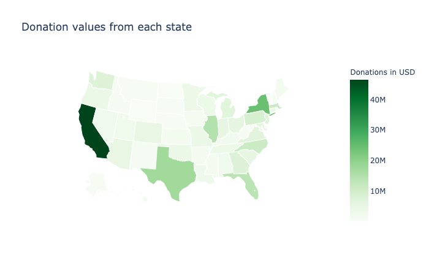
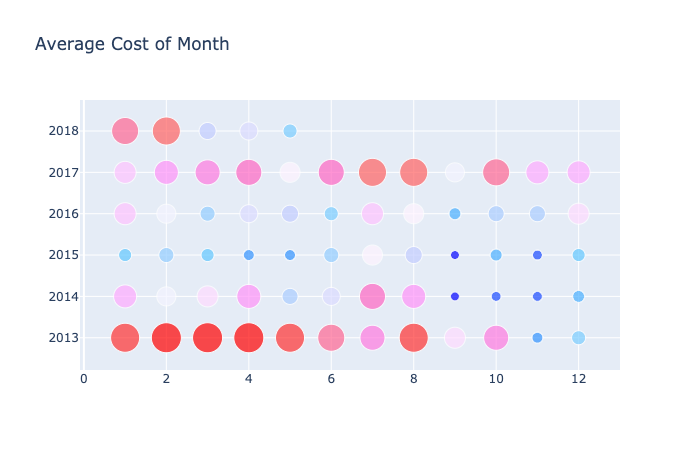

# School_donations_project

Design a recommendation system using PySpark that matches classroom charity projects to the most probable donors nationwide using Pyspark.

Our presentation slidedeck can be [found here](https://docs.google.com/presentation/d/1FJU4YzjeObEk91HBzrgQ4pBWyNjErIMun06r4PqKwWI/edit?usp=sharing).

---

Background information:

Founded in 2000 by a Bronx history teacher, DonorsChoose.org has raised $685 million for America's classrooms. Teachers at three-quarters of all the public schools in the U.S. have come to DonorsChoose.org to request what their students need, making DonorsChoose.org the leading platform for supporting public education.

To date, 3 million people and partners have funded 1.1 million DonorsChoose.org projects. But teachers still spend more than a billion dollars of their own money on classroom materials. To get students what they need to learn, the team at DonorsChoose.org needs to be able to connect donors with the projects that most inspire them.

In the second Kaggle Data Science for Good challenge, DonorsChoose.org, in partnership with Google.org, is inviting the community to help them pair up donors to the classroom requests that will most motivate them to make an additional gift. To support this challenge, DonorsChoose.org has supplied anonymized data on donor giving from the past five years.

---

## Visualization 

### Average Cost Per Month

### Donation Amount of Each State

---

See our jupyter notebook for our initial exploratory data analysis done using PySpark.

Public data set can be found here:  https://www.kaggle.com/donorschoose/io

Project contributors include: [Nishat Khan](https://www.linkedin.com/in/nishat-parveen), [Zijun (Annette) Lin](https://www.linkedin.com/in/zijun-annette-lin), [Ming-Chuan Tsai](https://www.linkedin.com/in/kirsten-tsai-869724156), [Kathy Yi](https://www.linkedin.com/in/kathleen-yi), & [Mundy Reimer](https://www.linkedin.com/in/mundyreimer)
